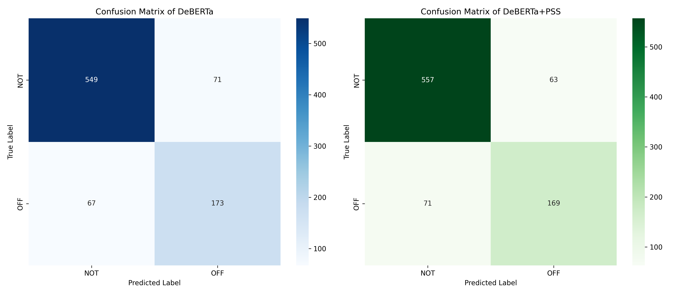

# Leveraging Sentiment for Offensive Text Classification
This repository contains all research steps (with relavent codes) to determine if leveraging sentiment improves model performance on the OLID dataset.

## Hypothesis
*Does utilizing respective sentiment improves models performance on offensive text classification task?*

## Uniqueness
To the best of the knowledge, no work experimented with concatenating sentiment label to the text.

## Dataset
[SemEval-2019 Task 6: SubTask A](https://aclanthology.org/N19-1144.pdf)

## Model to Predict Sentiment
[deberta-v3-ft-financial-news-sentiment-analysis](https://huggingface.co/mrm8488/deberta-v3-ft-financial-news-sentiment-analysis)

## Dataset After Prepending Predicted Sentiment (*PPS*)

## *PPS* Distribution

> High Neutral sentiment due to [over-numbered non-offensive text (NOT)](https://aclanthology.org/S19-2010/)

## Baseline Models & Performance
| Model | Macro-F1 score |
|-------|----------------|
| Unigram | 50.45 |
| Char 3-gram (C3) | 57.94 |
| C1 + C2 + C3 + C4 | 58.51 |
| [Bi-LSTM](https://www.bioinf.jku.at/publications/older/2904.pdf) | 76.78 |
| [DeBERTa](https://arxiv.org/abs/2006.03654)  | 81.22 |
| DeBERTa+*PPS* | **82.56** |

## Error Analysis
### Confusion Matrix: DeBERTa vs DeBERTa+*PPS*

> DeBERTa+*PPS* improves better NOT classification.

## Affect of Each Sentiment

> Negative sentiment has the most effect even though [most sample are Neutral sentiment.](https://github.com/KhondokerIslam/senti-affects-olid/tree/main?tab=readme-ov-file#pps-distribution)

## Reference
> If this repo comes to your any help, leave by a star *so that I know the senti effect ;)*

